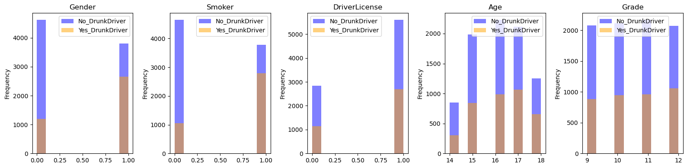
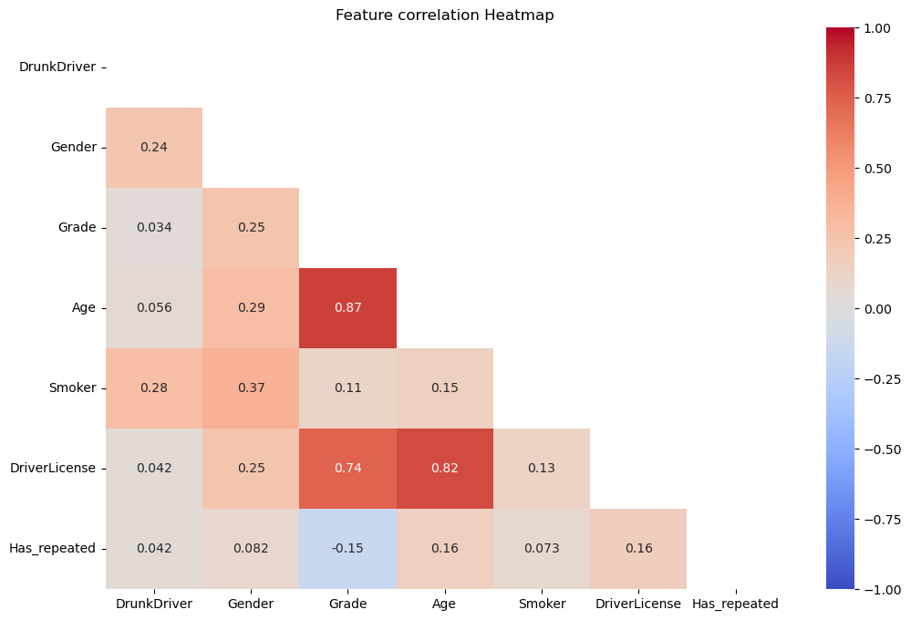

## Revealing Patterns in High Schoolers' Behavior: EDA and ML for Predicting and Preventing Riding with Drinking Drivers

**Project description:** In this project we will analyze the risk of high schoolers riding with drinking drivers by examining a dataset from the Youth Risk Behavior Surveillance System (YRBSS) in the U.S. Using Exploratory Data Analysis and Machine learning, we should identify factors contributing to this behavior and use the insights gained to develop preventive measures.

### 1. Import and Clean data 

We saould first import the data and perform some basic data cleaning steps, like getting dropping unwanted columns/null values and renaming columns so that they are more readable. 

```python
# Drop the first column that served as an index before
df = df.drop('Unnamed: 0', axis=1)

# Drop null values
df.dropna(inplace=True)

# Rename remaining columns
df.rename(columns={'age4': 'Age'}, inplace=True)
df.rename(columns={'female': 'Gender'}, inplace=True)
df.rename(columns={'grade': 'Grade'}, inplace=True)
df.rename(columns={'smoke': 'Smoker'}, inplace=True)
df.rename(columns={'ride.alc.driver': 'DrunkDriver'}, inplace=True)
```

### 2. EDA (exploratory data analysis)

now we can analyze the distribution of our data per feature, and then take a look at some overlaid plots to see if we can identify some potential differences between the high schoolers that ride with drinking drivers vs the ones that don't.


By taking a first look at our data we can definitely see some trends: <br><br>




• The female students seem to ride more often with drinking drivers <br><br>
• Smokers also seem to ride more frequently with drinking drivers <br><br>
• Grade, Age and Having a Driver's License did not seem to exhibit a different pattern between the passengers of drinking drivers <br><br>


### 3. Feature Engineering

Now we can create a new feature to try and make our machine learning models more effective. We can try to see if high schoolers that potentially repeated a school year at some point are at a higher risk of riding with drinking drivers

```python
def check_repeated(row):
    school_year = row['Grade']
    age = row['Age']
    
    if school_year == 9:
        expected_age = 15
    elif school_year == 10:
        expected_age = 16
    elif school_year == 11:
        expected_age = 17
    else:
        expected_age = 18

    if age > expected_age:
        return 1
    else:
        return 0

df['Has_repeated'] = df.apply(check_repeated, axis=1)
```

After that, we can check the correlation coefficients and our p values to see what features we will keep in our ml models



As expected, age, grade and having a driver's license are highly correlated and should not be added in conjunction to an ml model. From our EDA it makes sense to keep grade and drop the other two.

### 4. Create Machine Learning Models


### 5. Conclusion, actionable steps and project limitations

• Popular songs tend to have higher energy, be less explicit and last between 2 to 6 minutes.  <br><br>


To 

For more details see <a href="https://github.com/RodolfoAMaranhao/Predicting-Song-Popularity-on-Spotify">Project Files</a> 

