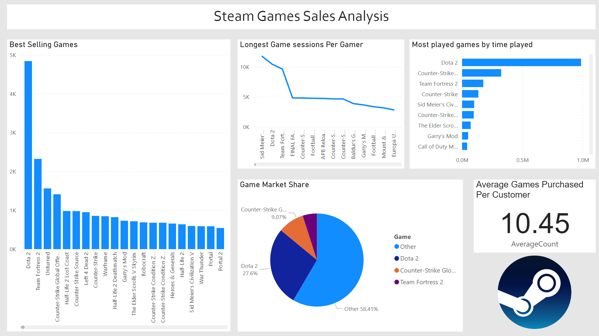

## Portfolio

---

[Using Random Forest to predict Song Popularity on Spotify](/Capstone_page.md)

---

[Analyzing the impact of exercise, alcohol consumption and smoking on sleep quality with Tableau and SQL](/Sleep_Study_page.md)

---

[Developing a Power BI dashboard for analyzing sales data of Steam games](/Steam_Dash_Page.md)

---

---

---

---

Page template forked from <a href="https://github.com/evanca/quick-portfolio">evanca</a>

<!-- Remove above link if you don't want to attibute -->
